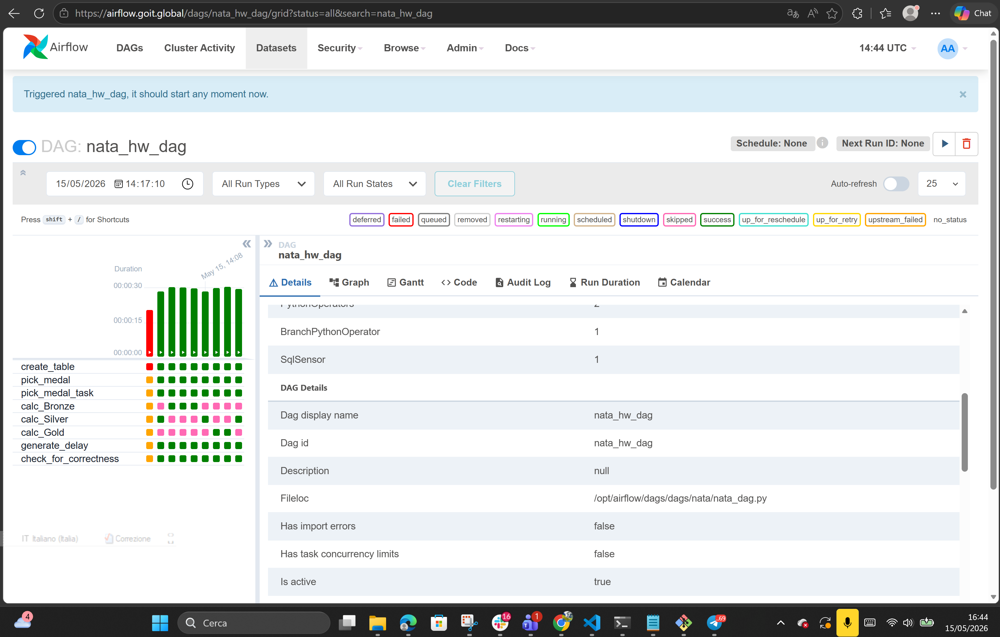

# Домашнє завдання: Apache Airflow

Цей проєкт містить реалізацію DAG (Directed Acyclic Graph) для Apache Airflow, який автоматизує процес обробки даних про олімпійські медалі в базі даних MySQL. Завдання демонструє навички роботи з операторами розгалуження, сенсорами та керуванням залежностями задач.

##  Опис виконаного завдання

Згідно з інструкцією, було реалізовано DAG (ID: `nata_hw_dag`)

## Результат успішного виконання

Нижче наведено скріншот інтерфейсу Airflow, який підтверджує успішне проходження всіх етапів :

## Результат

## Технічні деталі реалізації

* **Connection ID**: Для роботи з базою використано підключення `DBneodata`.

